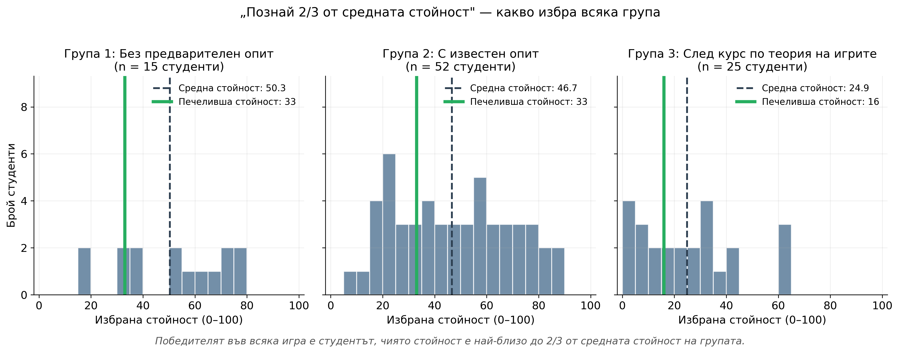
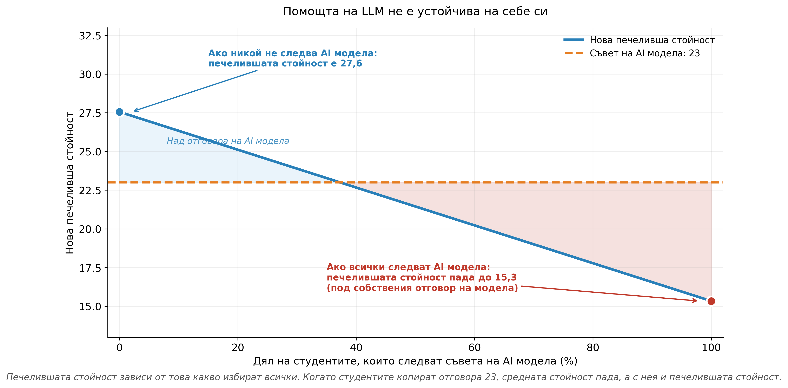
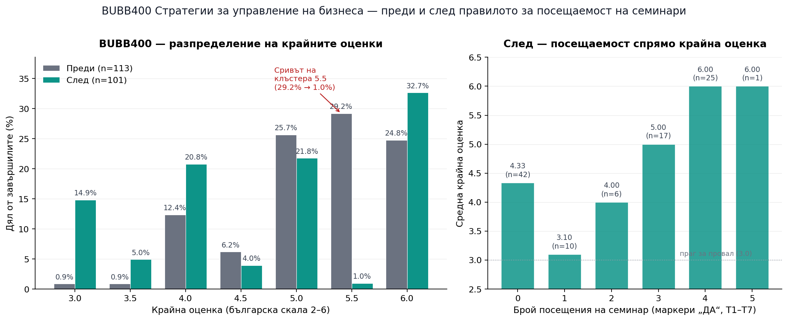

# Част 1 {background-color="#1a1a2e"}

::: {style="color: white; font-size: 1.4em;"}
Конкурси за красота
:::

::: {style="color: #d8d7e8; font-size: 0.7em; margin-top: 1.5em;"}
*никой не очаква това, а от него следва една теорема*
:::

## Една игра в аудитория {.scrollable-slide}

::: {style="font-size: 0.85em;"}

3 групи студенти: 

- 1) начинаещи: не познават правилата; 

- 2) изложени на играта веднъж; 

- 3) напреднали: VI сем, след "курс Теория на игрите"

**Правила**: всеки играч избира число в \[0, 100\]; печели играчът, чието число е най-близо до **2/3 от средната стойност** на групата.

**Защо точно тази игра?** Тя е каноничнен емпиричен тест за *стратегическа дълбочина* — колко стъпки напред от вида „аз мисля, че той мисли, че аз мисля..." реално правят хората.

:::

::: {.callout-note icon=false title="Равновесие"}
Теорията ни казва, че единственото равновесие на Неш, ако знаем, че другите играчи са рационални е 0 (или 1 при цели числа). Реалните индивиди почти никога не достигат до него.
:::

## Нека видим как може да изглежда помощта от ИИ


:::: {.columns}

::: {.column .fragment width="50%"}

::: {.llm-link-card .student-link}

::: {.llm-card-title}
Промпт на студент
:::

[Отвори в chatgpt.com](https://chatgpt.com/share/69ef3a0c-e4ac-83eb-ad9b-5163ddc0d7d9){.llm-open-link target="_blank"}

:::

:::

::: {.column .fragment width="50%"}

::: {.llm-link-card .teacher-link}

::: {.llm-card-title}
Промпт на преподавателя
:::

[Отвори в chatgpt.com](https://chatgpt.com/share/69f70d70-da98-83eb-a87a-e53dc04f3aad){.llm-open-link target="_blank"}

:::

:::

::::

## Данни: описателна статистика {.smaller .stats-slide}

::: {.fragment style="font-size: 0.72em;"}

| Група | n | Средно | Мед. | SD | Диапазон | 2/3 средно | Печели | Отд. от 23 |
|:------|--:|-------:|-----:|---:|:--------:|-----------:|-------:|-----------:|
| 1 — начинаещи | 15 | 50.3 | 50.0 | 20.2 | 18–78 | 33.6 | 33 | 10 |
| 2 — изложени веднъж | 52 | 46.7 | 47.0 | 22.1 | 9–88 | 31.1 | 33 | 10 |
| 3 — напреднали | 25 | 24.9 | 22.0 | 19.2 | 1–63 | 16.6 | 16 | 7 |


:::


## Твърдение 1 — Калибриране {.smaller}

{.plot-fit-calibration fig-align="center" width="100%"}

::: {style="font-size: 0.78em; text-align: center; margin-top: 0.3em;"}
**ИИ решение: 23.** &nbsp;&nbsp; Печеливши: **33, 33, 16.** &nbsp;&nbsp; Отдалеченост: **10, 10, 7.** &nbsp;&nbsp; P(печалба) = **0** и в трите групи.
:::

::: {.callout-tip icon=false title="Твърдение"}
За всяка фиксирана стойност $A \in [0, 100]$ съществува емпирично наблюдавано разпределение, в което $A$ е извън печелившия интервал. Оптималният отговор зависи от τ — а τ е **ненаблюдаемо** без специфично знание за конкретната група.
:::

## Твърдение 2 — Неправилна спецификация {.scrollable-slide}

::: {style="font-size: 0.85em;"}

Защо ИИ се ангажира с 23? Защото се базира на първата публикация, Nagel (1995):

$$g_k = \left(\tfrac{2}{3}\right)^k \cdot 50 \quad \Rightarrow \quad \{50,\, 33,\, 22,\, 15,\, 10\}$$

По-добро решение е модел използващ **когнитивна йерархия** (Camerer–Ho–Chong, 2004), при който играч от ниво k се базира на *комбинация* от по-ниските нива.

:::

::: {style="font-size: 0.8em; margin-top: 0.6em;"}

| Стъпка $k$ | Folk level-k (1995) | Poisson-CH, τ=1.5 (2004) |
|:----------:|:-------------------:|:------------------------:|
| 0 | 50 | 50 |
| 1 | 33.3 | 33.3 |
| 2 | 22.2 | **≈ 26.7** |
| 3 | 14.8 | **≈ 24.0** |
| ∞ | → 0 | **→ 22.4** |

:::

::: {style="font-size: 0.85em; margin-top: 0.8em;"}
**Извод.** ИИ възпроизвежда "основната литература", но поведението на реалните студенти се описва по-добре от кривата на CH.
:::

## Твърдение 3 — Рефлексивност {.scrollable-slide}

{.plot-fit-reflexivity fig-align="center" width="85%"}


::: {.callout-tip icon=false title="Твърдение"}
Дори ИИ, който знае τ, дава **самоопровергаваща се** препоръка: нарастването на възприемането й измества правилният отговор. 
:::

## Една теорема {.scrollable-slide}

::: {.callout-note icon=false title="Теорема (която няма да доказваме сега)"}
Нека $f(k; \tau)$ е Poisson-CH популация. Тогава:

1. Не съществува отговор $A \in [0, 100]$, който да е печелившата стойност във всяко реализуемо разпределение.
2. Дори $\tau$-базиран експертен съвет се проваля рекурсивно: не съществува $A^*$, който да остава печелившата стойност, когато се възприема от положителен дял от играещите играта.
:::

::: {style="font-size: 0.85em; margin-top: 1em;"}

**Трите провала са независими и кумулативни:**

- Калибриране: τ е ненаблюдаемо
- Спецификация: тренираният модел е сгрешен
- Рефлексивност: дори правилен модел се инвалидизира при достатъчно възприемане

:::

## Защо това е важно за нас {.scrollable-slide}

::: {style="font-size: 0.88em;"}

Това упражнение демонстрира важността на **структурата**: правилният отговор на задачата зависи от информация, до която ИИ по условие няма достъп.

:::

::: {style="font-size: 0.85em; margin-top: 0.6em;"}

**Приложения:**

- *Координационни игри* (Schelling focal points) — фокусната точка зависи от вярванията на конкретната група
- *Пазарно сигнализиране* — локалното разпределение на типове не е в данните на ИИ
- *Преговори*, в които поведението е реакция на локален контекст
- *Всяка задача, в която „групата от студенти в аудиторията" е част от входните променливи*

:::


## GreenBox — преговори със скрита информация {.scrollable-slide}

Петима участници в група трябва да организират платформа за фермерска храна в София.

- **Предприемач** — идея, пазарно проучване, ограничен капитал, нужда от контрол.
- **Софтуерен инженер** — специфична инвестиция на време, алтернативна работа, риск от провал.
- **Фермер** — продукция, логистика, риск от зависимост от един купувач.
- **Логистика** — специализиран бус, мрежа от шофьори, избор между заплата и комисиона.
- **Бизнес ангел** — капитал, менторство, право на вето и контрол върху разходите.

**Защо е структурно устойчиво на ИИ:** ефикасното споразумение зависи от частната информация, от това какво участниците решават да разкрият, и от реалната траектория на преговорите.

::: {.exercise-file-link}
[Word файл: seminar-01-student-handout.docx](seminar-01-student-handout.docx){target="_blank"}
:::

## Diamond Sight — неблагоприятна селекция и ефективна търговия {.scrollable-slide}

Групите играят два рунда на пазар за диаманти.

- **Рунд 1 — отворен пазар.** Купувачите могат да инспектират диаманти срещу цена, после преговарят и наддават за отделни камъни.
- **Рунд 2 — системата "sight".** Продавачът предлага пакети на фиксирана цена, без инспекция и без преговори: take-it-or-leave-it.
- **Анализ.** Сравнява се общият излишък: печалби на купувачите + приходи на продавача − разходи за инспекция.

**Защо е структурно устойчиво на ИИ:** ИИ може да обясни неблагоприятната селекция, но не може да замести реалните разходи за информация, пазаренето, отказите и резултатите, които групата произвежда в стаята.

::: {.exercise-file-link}
[Word файл: diamond_sight_exercise-2.docx](diamond_sight_exercise-2.docx){target="_blank"}
:::

## В търсене на система от инструменти {.scrollable-slide}

::: {style="font-size: 0.9em;"}

Ако задачите могат да бъдат структурно устойчиви на ИИ, остава следващият въпрос:

::: {style="text-align: center; font-style: italic; margin: 1.2em 0;"}
**Какъв вид оценяване извлича сигнала, който такива упражнения произвеждат?**
:::

Нуждаем се от механизъм, който:

- максимизира ангажираността през целия семестър;
- усреднява случайните вариации и позволява сравнение между курсове;
- остава устойчив на ИИ.

:::

# Част 2 — Оценяване {background-color="#1a1a2e"}

## Проблемът с процеса {.scrollable-slide}

Проблемът е в процеса, който генерира данните (ако не е наблюдаем):

- "Курсовите работи", "есетата", "заданията" трябваше да отпаднат в началото на 2023 г.
- Пределните разходи за генериране на гладък текст ≈ 0.
- 5.5 от едно неаудиторно занятие след 2023 г. е съставен сигнал за способността на студента *и* за ИИ-подкрепа, с неизвестни тегла (но асимптотично приближаващи $0 \cdot а + 1 \cdot b$).

> Оценяването по скалата 2–6 не е достоверен сигнал за знания/умения/компетенции

## Едно просто правило {.scrollable-slide}

$$
G \;=\; 2 + \min\!\left(4,\ \sum_{t=1}^{5} X_t\right), \qquad X_t \in \{0,1\}
$$

Три характеристики:

- **По-силен стимул за присъствие всяка седмица.** $X_t = 1$ изисква присъствие; ако задачите са практически, решаването им зависи от познаването на материала от предходните седмици.
- **Устойчивост на случайни отклонения**: увеличеният брой наблюдения/изяви намалява шума в оценяването.
- **По-устойчиво на използването на ИИ**: ако оценяването е индивидуално/групово, базира се на локален контекст, наблюдава се от преподавателя.


## BUBB400 — резултати преди/след {.scrollable-slide}

::: {.columns}
::: {.column width="50%"}
**Преди**

- Тест + презентация
- 3 изпитни слота
- Без изискване за присъствие
- $n = 113$ завършили
:::
::: {.column width="50%"}
**След**

- 7 слота с изискване за присъствие
- 4 необходими презентации за "Отличен"
- Финален изпит - тест + задача за изчисление
- $n = 101$ завършили
:::
:::

## Основният резултат

{fig-align="center" width="92%"}

## Какво показват данните {.scrollable-slide}

::: {.columns}
::: {.column width="55%"}
**Клъстерът "ИИ" 5.5 се срива.**
$29.2\% \rightarrow 1.0\%$.

Разпределението се променя *и в двете* посоки:
$+7.9$ пр.п. при 6.0,
$+14.0$ пр.п. при 3.0.

**Делът на получилите текуща/финална оценка се повишава:** $68.9\% \rightarrow 75.4\%$.

**В рамките на "След":** всеки студент с $4+$ присъствия получава 6.0 ($n = 25$).
:::
::: {.column width="45%"}
::: {.callout-note title="Интерпретация, с резерви"}

Разпределението "Преди" има формата, която бихме очаквали, ако съществена част от предадените работи са генерирани от ИИ — мода = 5.5, силно концентрирано в горния край на скалата, тънка или почти липсваща лява опашка.

Разпределението "След" стимулира студентите да участват в курса с това, което могат да демонстрират под наблюдение.

:::
:::
:::

## Защо това е устойчиво на манипулация {.scrollable-slide}

Ако вероятността за използване на ИИ в отделна задача е $c$, тогава при еднократно оценяване вероятността за използване на ИИ отново е $c$. При правилото „4 от 5 семинара“ обаче имаме:

$$
\Pr(\text{„използване на ИИ“ за отлична оценка}) \;=\; 5c^4 - 4c^5.
$$

При $c = 0.5$ имаме следното: еднократно оценяване - $\mathbf{0.50}$ срещу „4 от 5 семинара“ - $\mathbf{0.19}$.
. . .


Това създава структура, в която **хетерогенността на задачите и наблюдението само усилват ефекта от правилото.**

## От оценяване към ангажираност {background-color="#1a1a2e"}

Промяната на механизма за оценяване е необходимо, но недостатъчно условие

Наблюдаваните задача за оценяване са ефективни, ако студентите идват на лекции — и идват *подготвени*.

Какви са условията за това?


# Част 3 — Курсът като жива система {background-color="#1a1a2e"}

## Две повърхности, една система {.scrollable-slide}

Съдържанието на курса не е само информация. То има две плоскости, които работят заедно.

::: {.columns}
::: {.column width="50%"}
**За "теорията" — Quarto reveal.js.**

Съдържание като код. Слайдове, графики, уебсайтове и табла от един и същ източник.
:::
::: {.column width="50%"}
**За ангажираността — приложения в реално време и ограничен ИИ.**

Студентите правят неща в аудиторията, генерират данни, а после учат използвайки паметта на курса.
:::
:::

> Един устойчив на ИИ курс поддържа система, в която присъствието, действието и доказателствата за "компетенции" са част от съдържанието.

## Защо приложенията са част от съдържанието {.scrollable-slide}

Три свойства на дизайна:

- **На живо.** Студентите взимат решения като са ограничени във времето.
- **Контекстуалност.** Резултатите зависят от поведението на участващите в аудиторията.
- **ИИ-ортогонално.** Стратегическата информация живее в главите на студента и в колективното поведение на групата — не в промпта.

## Три примера {.scrollable-slide}

| Име | Какво демонстрира? | Променливи |
|:---|:---|:---|
| **Matching Dashboard** | Симулира "Two-sided-matching" | Предпочитания, стабилност, блокиращи двойки |
| **Labor Auction Sim** | Стимули и скрито действие | Заплати, безработица, спестяване на усилия |
| **Session Quiz** | Присъствен тест, който е (ограничено) ИИ-устойчив | Присъствие, отговори, подозрителни събития |

## Matching Dashboard {.scrollable-slide}

Централизиран пазар за съпоставяне (two-sided mathching).

- Студентите са от двете страни на двустранен пазар (болници и специализанти).
- Всяка страна подава списък на предпочитания.
- Преподавателят заключва пазара; алгоритъмът се изпълнява.
- Таблото показва съпоставянията, стабилността и всички блокиращи двойки.

## Matching Dashboard — на живо

[Matching Dashboard](https://quantumjazz.github.io/genb-course/matching-dashboard/frontend/){target="_blank"}

<iframe
  src="https://quantumjazz.github.io/genb-course/matching-dashboard/frontend/"
  class="app-frame"
  loading="lazy">
</iframe>

## Labor Auction Sim {.scrollable-slide}

Симулация на пазар на труда.

- Студентите са само служители; фирмите "публикуват" работни места и заплати.
- Във всеки етап студентите избират първо къде да кандидатстват, после дали да работят усилено или да спестяват усилия.
- Таблото визуализира заплати, брой на безработните и спестяването на усилия, докато пазарът се развива.

## Labor Auction Sim — на живо

[Преподавателска конзола](https://quantumjazz.github.io/genb-course/labor-auction-sim/frontend/instructor.html){target="_blank"}

<iframe
  src="https://quantumjazz.github.io/genb-course/labor-auction-sim/frontend/dashboard.html?code=SESSIONCODE"
  class="app-frame"
  loading="lazy">
</iframe>

## Session Quiz {.scrollable-slide}

Браузър-базиран тест, предназначен за телефони. Банки с въпроси, филтрирани по теми. Експорт на данни за всяка сесия.

**Анти-използване на ИИ функционалност:**

- Напускането на страницата на теста елиминира текущия въпрос.
- Превключването на приложения или загубата на фокус заменя въпроса с друг.
- Вариантите за отговор се разбъркват при всяко показване.
- Стриктният режим изисква цял екран и регистрира подозрителни събития.


## Session Quiz — на живо

[Преподавателска конзола](https://quiz.visiometrica.com/admin){target="_blank"}

Студентите сканират QR кода от конзолата или отварят директно линка за присъединяване:

::: {.join-link}
[https://quiz.visiometrica.com/](https://quiz.visiometrica.com/){target="_blank"}
:::


## Quarto reveal.js — съдържание като код {.scrollable-slide}

**Тази презентация е пример**

- Слайдове в Markdown форматс вграден HTML, JavaScript.
- Quarto може да произвежда слайдове, материали за раздаване, PDF-и и уебсайтове.
- Mermaid диаграми, MathJax, iframes за вграждане на приложения.
- Версии в Git; възпроизводимост.

За един преподавател, който поддържа курс сам, това намалява цената за поддържане на материалите актуални и консистентни между форматите.

## Преподавателски асистент, ограничен до курса {.scrollable-slide}

Чатбот, конфигуриран за конкретен курс.

- "Чете" одобрени от преподавателя PDF, DOCX и TXT.
- Разделя ги на пасажи; индексира ги за търсене.
- Извлича най-релевантните пасажи за всеки въпрос.
- ИИ отговаря **само** от извлечения контекст.
- Източниците се показват под всеки отговор.
- Слаби доказателства → изрично *"Не знам."*

## Как се създава отговорът {.scrollable-slide}

```{mermaid}
%%{init: {"themeVariables": {"fontSize": "21px", "fontFamily": "Source Sans Pro, Helvetica Neue, Helvetica, Arial, sans-serif", "fontWeight": "650"}, "flowchart": {"nodeSpacing": 60, "rankSpacing": 70}} }%%
flowchart TB
  A["Документи на курса"] --> B["Пасажи"]
  B --> C["Векторни представяния"]
  C --> D["Индекс за търсене"]
  E["Студентски въпрос"] --> F["Извличане на<br/>релевантни пасажи"]
  D --> F
  F --> G["ИИ отговаря чрез<br/>доказателства от курса"]
  G --> H["Отговор + източници"]
  F --> I["Слаби доказателства"]
  I --> J["Ясен отказ от отговор"]
```

## Демонстрация на живо

[AI Teaching Assistant](https://society-economics-business.visiometrica.com){target="_blank"}

- Статус: [`/setup`](https://society-economics-business.visiometrica.com/setup)
- Индексирани документи: [`/documents`](https://society-economics-business.visiometrica.com/documents)


## Обобщение {background-color="#1a1a2e"}

Курсът като жива система променя ролята на ИИ:

- **Неподходящ инструмент** за заместване на учене, защото задачата зависи от живи, локални и динамични данни.
- **Полезен инструмент** за учене, когато е ограничен до материалите на курса.

. . .

::: {.callout-tip icon=false title="Вместо заключение"}

Устойчивостта не идва от забрана или разкриване. Идва от дизайна: студентите генерират данни, решават задачи, курсът произвежда контекст, а ИИ се прилага вътре в границите на всичко това.

:::